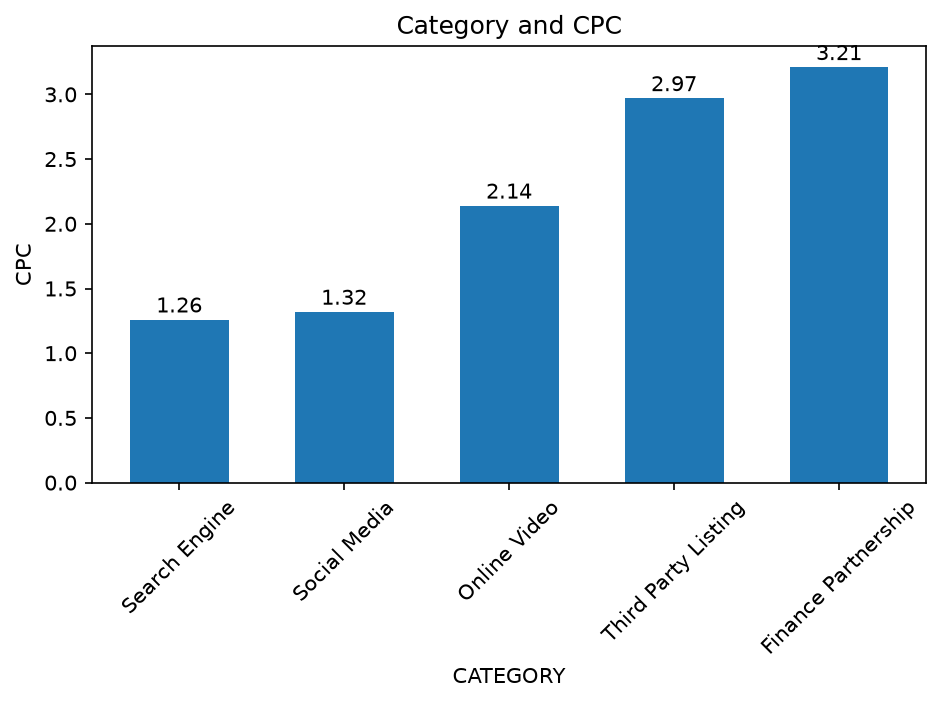
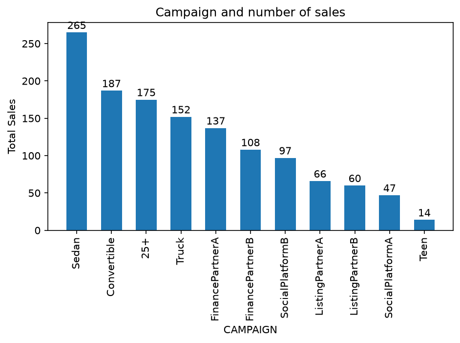
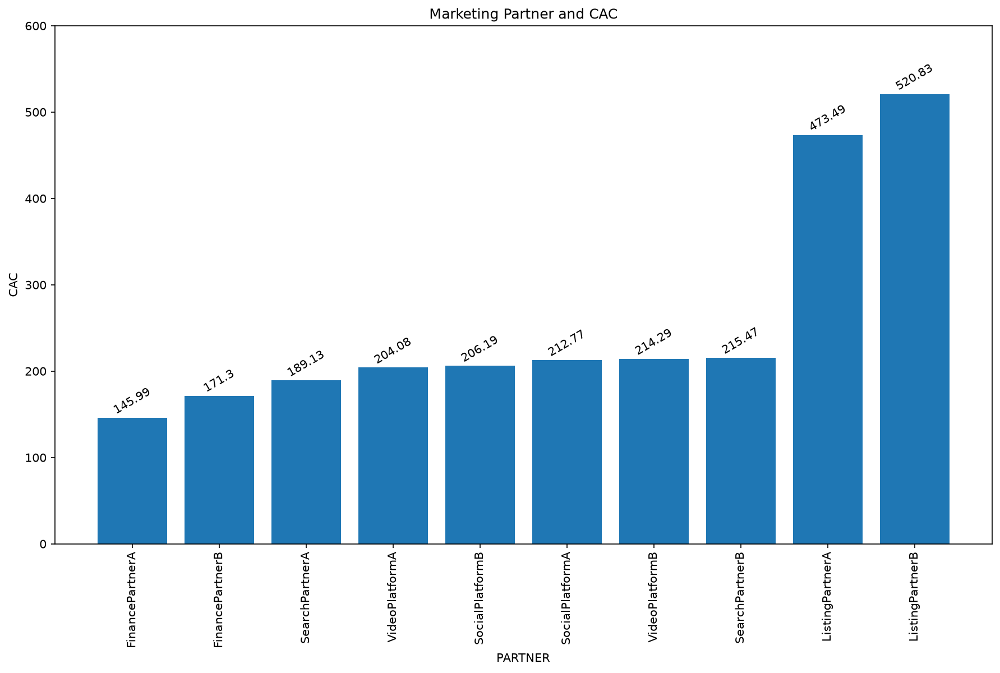
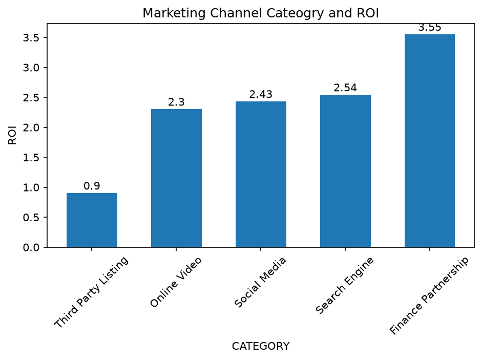
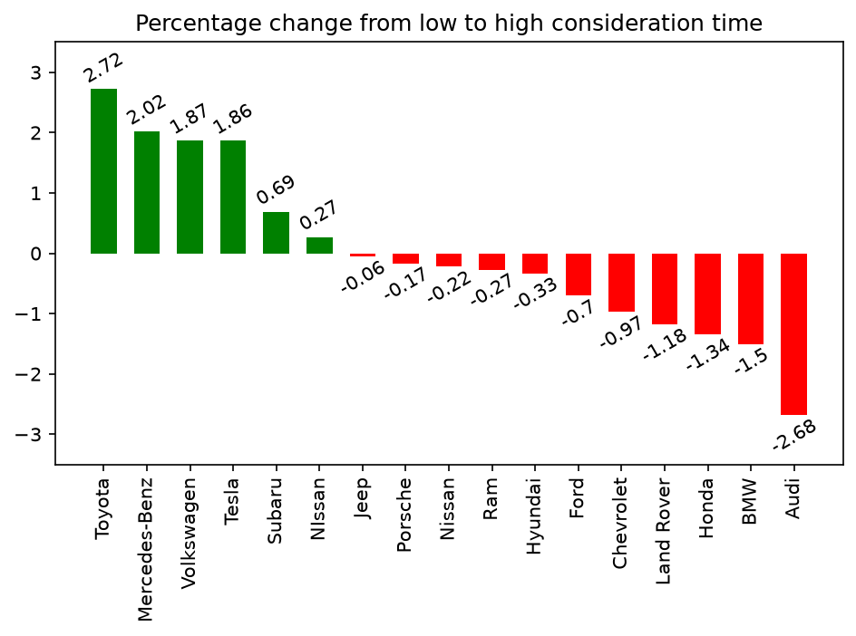
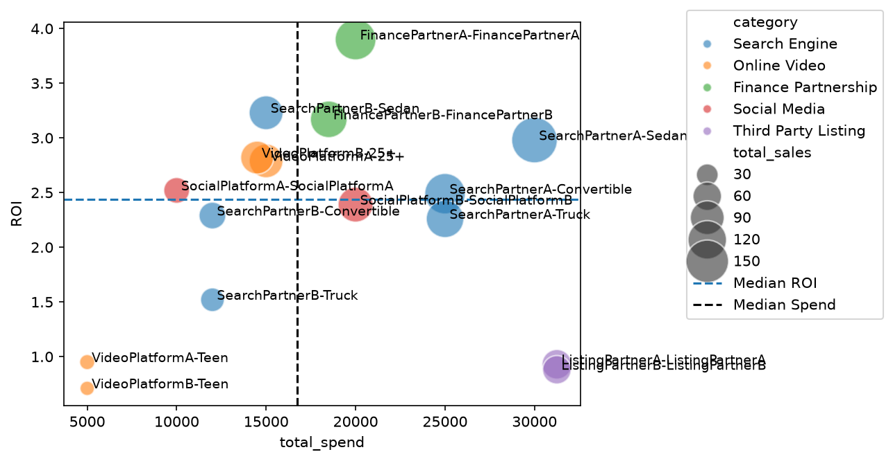
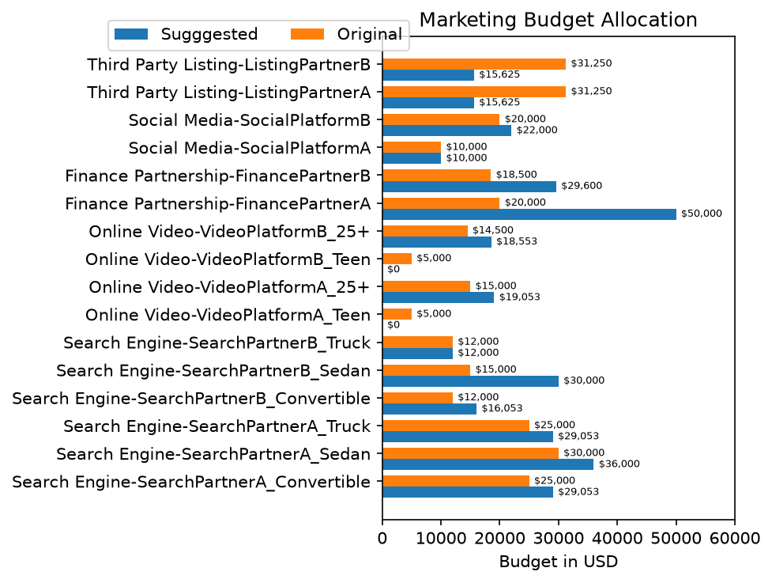
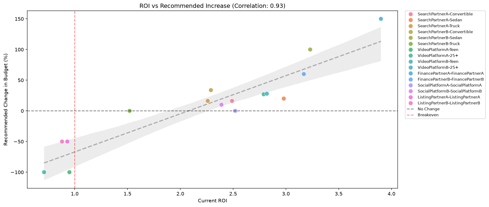

# Multi-Channel Marketing Attribution & Budget Optimization

Author: Ahmed Bokhari
Tools: Python, Pandas, NumPy, Matplotlib, Jupyter Notebook

## Overview

I built this project to figure out which marketing channels were actually driving profitable sales for an online vehicle marketplace, and how a multi-million dollar annual ad budget should be reallocated based on the data. I used first-touch attribution to credit channels properly, benchmarked CPC/CAC/ROI across partners and campaigns, looked at how customers actually move across channels before converting, measured how long that takes, and then ran t-tests on spend vs. sales to back up a budget reallocation recommendation. That recommendation ends up with a 0.93 correlation between a channel's current ROI and how much its budget should change, which is a good sign the logic holds up.

Note on the data: everything in this repo is synthetic. `notebooks/randomdataset.py` generates it to match the structure and general shape of the real analysis, but there's no real user, partner, spend, or sales data in here. Channel and partner names like `SearchPartnerA` or `FinancePartnerB` are just placeholders.

## Repository Structure

```
├── data/                    # Synthetic, anonymized dataset (CSV)
├── images/                  # Charts referenced in the report
├── notebooks/
│   ├── report.ipynb         # Write-up: methodology, findings, recommendations
│   ├── workspace.ipynb      # Actual analysis code (cleaning, metrics, charts)
│   └── randomdataset.py     # Generates the synthetic data/ files
└── README.md
```

## Dataset

Six tables, joined on user/lock/sale IDs:

| File | Description |
|---|---|
| `ad_channels.csv` | Channel ID to channel/campaign name mapping |
| `clicks.csv` | Clickstream: user, channel, timestamp |
| `locks.csv` | Rate locks (a funnel step before sale) |
| `sales.csv` | Completed sales: vehicle, financing, trade-in, delivery distance |
| `spend.csv` | Daily ad spend by channel |
| `vehicles.csv` | Make/model/bodystyle reference table with average margin |

Roughly 96k users, 169k clicks, 14k locks, and 1,350 sales across 16 channels spanning Search Engine, Online Video, Finance Partnership, Social Media, and Third Party Listing categories.

## What I Did

**Attribution:** First-touch attribution to credit whichever channel actually originated the customer, rather than whatever channel happened to close the sale.

**Channel efficiency:** CPC, CAC, and ROI computed per channel, partner, and campaign to see where money was being spent well and where it wasn't.

**Customer journey:** Looked at how many channels and bodystyles a customer touches before locking a car, since very few convert off a single click.

**Conversion lag:** Measured the time between first touch, lock, and sale, including a 90-day cutoff to flag customers who take a long time to decide.

**Budget optimization:** Ran a t-test (alpha 0.05) per channel on spend vs. sales to see where more budget is statistically likely to actually move the needle, then used that to build the full reallocation plan.

## Key Findings

FinancePartnerA is the most efficient partner I looked at, with the lowest CAC and the highest ROI (3.9). More broadly, Finance Partnerships as a category have the best ROI (3.55), while Third Party Listings are the worst (0.9). These customers pay mostly in cash, don't finance or trade in much, and tend to be farther from our locations, so CAC and CPC end up considerably higher there.

Search Engine has the lowest CPC of any category and drives 46% of sales, which makes sense since it's a pull channel since people are already searching with intent to buy, so the ad doesn't have to work as hard to earn the click.

Customers rarely convert on their first touch. Only 27% of locks happen on the first-touch channel, and a lot of customers switch bodystyle (usually Sedan to Convertible or back) somewhere along the way. That's a good argument for running multiple channels and funnels instead of over-optimizing for last click.

Consideration time is longer than I expected going in. The median first-touch-to-lock is 59 days, and about two-thirds of customers take somewhere between 24 and 94 days. Campaigns should probably be designed to run across that whole window instead of assuming a quick turnaround.

Putting all of this together, the budget reallocation I recommend increases spend on the channels with strong ROI and a statistically significant relationship between spend and sales (like FinancePartnerA and SearchPartnerA), holds steady on channels that look efficient but aren't responding to more budget, and cuts spend on channels with ROI under 1, like the Third Party Listings and Teen campaigns.

The full reasoning behind each of these, including the numbers I didn't put here, is in [`notebooks/report.ipynb`](notebooks/report.ipynb).

## Visualizations

| | |
|---|---|
|  |  |
|  |  |
|  |  |
|  |  |

## How to Run

```bash
pip install pandas numpy matplotlib

# (optional) regenerate the synthetic dataset
cd notebooks
python randomdataset.py

# open the notebooks
jupyter notebook
```

`workspace.ipynb` has the full analysis and regenerates the charts in `images/`. `report.ipynb` is the write-up if you just want to read through the findings.
